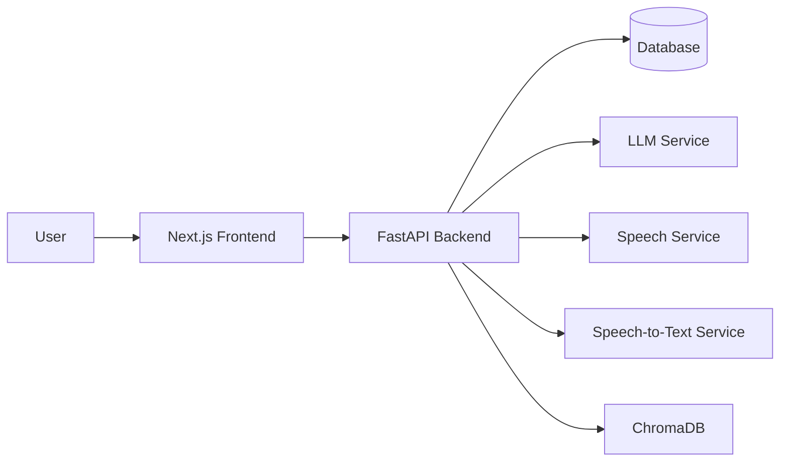
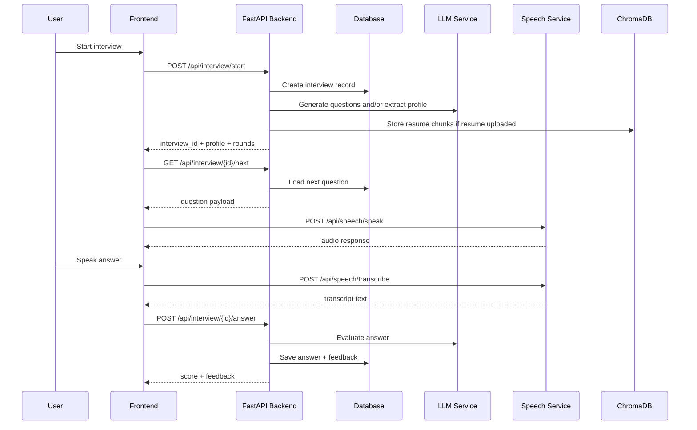
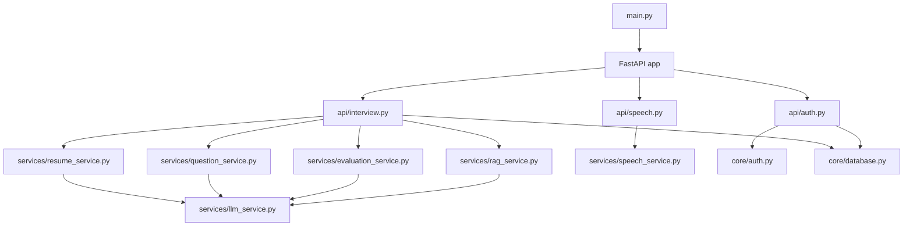
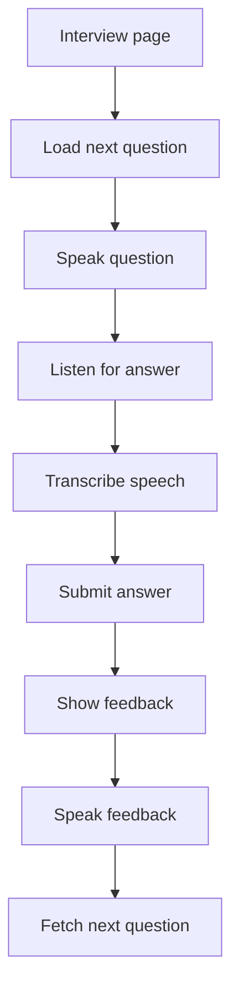

# MockMate Architecture

## Overview

MockMate is a full-stack interview practice app with a FastAPI backend and a Next.js frontend.

The system supports:

- Authentication and session-based access
- Starting an interview from a role, level, and resume
- Generating interview questions with an LLM-backed service
- Speaking questions aloud through TTS
- Recording and transcribing answers
- Evaluating answers and generating feedback/reports
- Optional resume ingestion into ChromaDB for retrieval

## High-Level Components

- Frontend: Next.js app in `frontend/`
- Backend API: FastAPI app in `backend/`
- Database: SQLAlchemy async models with the configured database URL
- LLM layer: `services/llm_service.py`
- Speech layer: `services/speech_service.py`
- Retrieval layer: `services/rag_service.py`
- Resume parsing: `services/resume_service.py`
- Evaluation layer: `services/evaluation_service.py`
- Question generation: `services/question_service.py`

## Component Diagram

## Request Flow

## Interview Lifecycle

### 1. App startup

- `backend/main.py` creates the FastAPI app.
- Database tables are initialized during lifespan startup through `core.database.init_db()`.
- CORS allows the frontend running on `http://localhost:3000`.

### 2. Interview creation

- The frontend sends role, level, rounds, job description, and optional resume to `POST /api/interview/start`.
- The backend stores the interview in the database.
- If a resume is provided, it is parsed and the profile is extracted.
- The question service generates a set of questions for each requested round.
- Resume text can be chunked and stored in ChromaDB for later retrieval.

### 3. Question delivery

- The frontend requests `GET /api/interview/{interview_id}/next`.
- The backend returns the next queued question from the database.
- The frontend speaks the question using `POST /api/speech/speak`.

### 4. Answer capture

- The user answers by voice or text.
- Voice input is sent to `POST /api/speech/transcribe`.
- The transcript is shown in the UI and forwarded to `POST /api/interview/{interview_id}/answer`.
- The backend evaluates the answer with the LLM service.

### 5. Feedback and progression

- The backend stores the score, feedback, strengths, weaknesses, and better answer.
- The frontend speaks the feedback aloud.
- After a short pause, the app automatically fetches the next question.

### 6. Completion

- When all rounds are complete, the backend marks the interview as completed.
- The frontend navigates to the report page.
- The report summarizes scoring and overall performance.

## Backend Flow in More Detail

## Frontend Flow in More Detail

## Key Files

- [backend/main.py](backend/main.py)
- [backend/api/interview.py](backend/api/interview.py)
- [backend/api/speech.py](backend/api/speech.py)
- [backend/services/llm_service.py](backend/services/llm_service.py)
- [backend/services/question_service.py](backend/services/question_service.py)
- [backend/services/evaluation_service.py](backend/services/evaluation_service.py)
- [backend/services/rag_service.py](backend/services/rag_service.py)
- [backend/services/resume_service.py](backend/services/resume_service.py)
- [frontend/app/interview/[id]/page.tsx](frontend/app/interview/[id]/page.tsx)

## Notes

- The app currently depends on external AI services for generation, transcription, and speech.
- If the Chroma server is unavailable, resume retrieval now fails gracefully instead of blocking app startup.
- The frontend interview page automatically advances through question, answer, feedback, and next question cycles.

## Visual Preview

The Mermaid diagrams above render as visual flow diagrams in Markdown preview. If you want a dedicated image file later, I can convert the main component or sequence diagram into an SVG-friendly format next.
